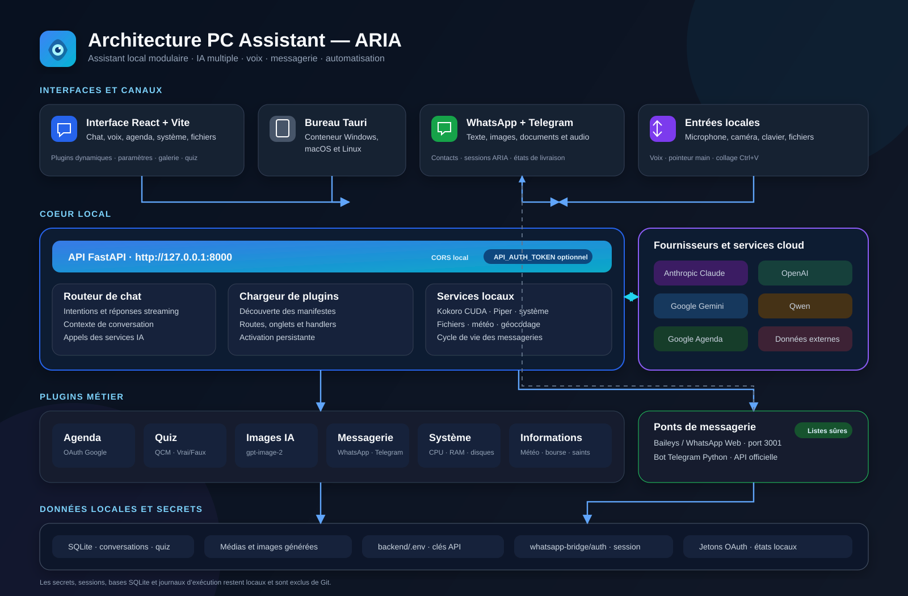
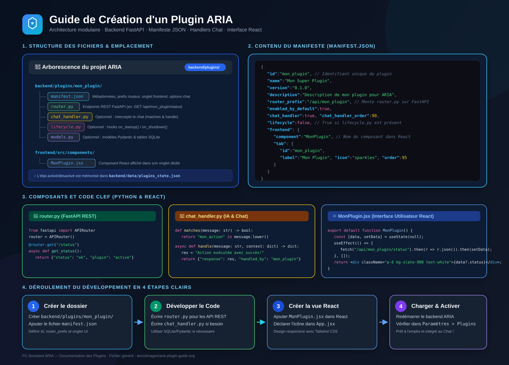

# PC Assistant — ARIA

ARIA est un assistant personnel local avec une interface React et une API FastAPI. Il réunit
plusieurs fournisseurs d'intelligence artificielle, la synthèse vocale française, la gestion de
fichiers et du système, Google Agenda, des quiz, la génération d'images et une messagerie
WhatsApp/Telegram.

## Fonctionnalités

### Intelligence artificielle

- Chat avec réponses progressives (streaming).
- Fournisseurs sélectionnables dans les paramètres :
  - Anthropic Claude ;
  - OpenAI ;
  - Google Gemini ;
  - Qwen via l'API compatible OpenAI de DashScope.
- Modèle et clé API mémorisés séparément pour chaque fournisseur.
- Clés conservées uniquement dans `backend/.env` et jamais renvoyées au navigateur.
- Génération et sauvegarde de quiz QCM ou Vrai/Faux.
- Génération d'images OpenAI avec `gpt-image-2`, formats carré, portrait et paysage.
- Galerie locale des images avec téléchargement et suppression.

> L'intégration Google Agenda avec appels d'outils utilise actuellement Anthropic. Le chat et les
> quiz utilisent le fournisseur sélectionné dans les paramètres.

### Voix et contrôle

- Synthèse vocale française locale avec Kokoro ONNX (CPU ou CUDA).
- Piper local comme moteur rapide.
- Voix du navigateur comme solution de repli.
- Lecture en streaming dès la première phrase.
- Assistant vocal et pointeur contrôlé par la main avec calibrage.

### Outils et plugins

- Agenda Google : consultation et gestion des événements.
- Surveillance CPU, mémoire et disques.
- Navigation et recherche de fichiers.
- Saint du jour, météo et informations locales.
- Informations boursières, devises et métaux.
- Architecture de plugins activables depuis l'interface.

### WhatsApp et Telegram

- Conversations WhatsApp consultables dans ARIA.
- Synchronisation des messages entrants et sortants.
- Envoi de texte, images, documents et audio.
- Collage d'une image avec `Ctrl+V`.
- États d'envoi : en attente, envoyé, livré, lu ou échoué.
- Carnet de contacts local.
- Activation des réponses ARIA avec `@aria start` et arrêt avec `@aria stop`.
- Bot Telegram avec liste d'utilisateurs autorisés.
- Déconnexion séparée de WhatsApp et Telegram depuis le plugin Messagerie.

WhatsApp repose sur Baileys, une bibliothèque non officielle fonctionnant comme WhatsApp Web.
L'utilisation d'un numéro dédié est recommandée. Consulte
[`whatsapp-bridge/README.md`](whatsapp-bridge/README.md) avant de l'activer.

## Architecture



```text
pc-assistant/
├── backend/             API FastAPI, SQLite, IA, TTS et plugins
│   ├── plugins/         Extensions découvertes dynamiquement
│   ├── routes/          Routes centrales du chat
│   ├── services/        Services IA et services locaux
│   └── tests/           Tests pytest
├── frontend/            Interface React, Vite et Tailwind CSS
├── whatsapp-bridge/     Pont Node.js entre WhatsApp et FastAPI
├── desktop/             Application de bureau Tauri
└── ETAT_APPLICATION.md  Description technique détaillée
```

Les plugins déclarent leur API et leur onglet dans un `manifest.json`. Le backend les découvre
au démarrage et le frontend charge leur composant React à la demande.

### Développer un Plugin ARIA



Chaque plugin est un dossier autonome sous `backend/plugins/<id>/` composé de :
- **`manifest.json`** : Déclaration des métadonnées, préfixe de routeur API, handler de chat et onglet React.
- **`router.py`** *(optionnel)* : Expose un `APIRouter()` FastAPI monté automatiquement au démarrage.
- **`chat_handler.py`** *(optionnel)* : Intercepte les requêtes du chat via `matches(message)` et `async handle(message, context)`.
- **`lifecycle.py`** *(optionnel)* : Hooks de démarrage/arrêt (`on_startup`, `on_shutdown`) pour sous-processus.
- **Composant React** : Fichier sous `frontend/src/components/` chargé dynamiquement selon le manifest.

## Prérequis

- Python 3.11 ou plus récent ;
- Node.js 18 ou plus récent ;
- Git ;
- Rust uniquement pour construire l'application Tauri ;
- une clé pour chaque service externe utilisé.

Sous Windows, une carte NVIDIA compatible et les bibliothèques CUDA permettent à Kokoro
d'utiliser le GPU. Le fonctionnement sur CPU reste possible.

## Installation

### 1. Cloner le projet

```powershell
git clone https://github.com/patgarcia66240-cmd/pc-assistant.git
Set-Location pc-assistant
```

### 2. Préparer le backend

```powershell
Set-Location backend
python -m venv venv
.\venv\Scripts\Activate.ps1
pip install -r requirements.txt
Copy-Item .env.example .env
```

Modifie ensuite `backend/.env`, ou démarre l'application et utilise **Paramètres** pour
enregistrer le fournisseur IA, le modèle et la clé correspondante.

Lance l'API :

```powershell
.\venv\Scripts\python.exe main.py
```

### 3. Préparer le frontend

Dans un second terminal :

```powershell
Set-Location frontend
npm install
npm run dev
```

Ouvre ensuite <http://localhost:5173>.

### 4. Préparer WhatsApp (facultatif)

```powershell
Set-Location whatsapp-bridge
npm install
Copy-Item .env.example .env
npm start
```

Le secret `WHATSAPP_BRIDGE_SECRET` doit être identique dans les fichiers `.env` du backend et du
pont. Au premier démarrage, scanne le QR code avec **WhatsApp > Appareils liés**.

Lorsque le backend gère le cycle de vie du plugin Messagerie, il peut lancer automatiquement le
pont WhatsApp et le bot Telegram.

## Configuration IA

| Fournisseur | Variable de clé | Modèle par défaut |
| --- | --- | --- |
| Anthropic | `CLAUDE_API_KEY` | `claude-sonnet-4-5-20250929` |
| OpenAI | `OPENAI_API_KEY` | `gpt-4.1-mini` |
| Google Gemini | `GEMINI_API_KEY` | `gemini-2.5-flash` |
| Qwen | `QWEN_API_KEY` | `qwen-plus` |

La génération d'images utilise également `OPENAI_API_KEY` et le modèle défini par
`OPENAI_IMAGE_MODEL` (`gpt-image-2` par défaut).

Les autres réglages disponibles sont documentés dans
[`backend/.env.example`](backend/.env.example), notamment :

- Google Agenda (`GOOGLE_CLIENT_ID`, `GOOGLE_CLIENT_SECRET`) ;
- WhatsApp et Telegram ;
- Kokoro et Piper ;
- données financières ;
- localisation ;
- protection optionnelle de l'API.

Ne commit jamais `backend/.env`, les jetons Google, les sessions WhatsApp ou toute autre clé.
Ces fichiers sont exclus par `.gitignore`.

## Développement

| Service | Adresse |
| --- | --- |
| Frontend | <http://localhost:5173> |
| Backend | <http://127.0.0.1:8000> |
| Documentation OpenAPI | <http://127.0.0.1:8000/docs> |
| Pont WhatsApp | <http://127.0.0.1:3001> |

Build du frontend :

```powershell
Set-Location frontend
npm run build
```

Tests backend :

```powershell
Set-Location backend
.\venv\Scripts\python.exe -m pytest tests -q
```

Les scripts `start-dev.sh` et `start-production.sh` sont disponibles pour les environnements
compatibles Bash.

## Données locales et sécurité

- Les conversations, contacts, quiz, médias WhatsApp et images générées sont stockés dans SQLite.
- Les clés API restent dans `backend/.env`.
- Les identifiants de session WhatsApp restent dans `whatsapp-bridge/auth/`.
- Les journaux d'exécution et états temporaires ne sont pas suivis par Git.
- `API_AUTH_TOKEN` permet de protéger les routes locales sensibles lorsqu'ARIA est exposé sur un
  réseau.
- Les listes `WHATSAPP_ALLOWED_NUMBERS` et `TELEGRAM_ALLOWED_USER_IDS` doivent rester restrictives.

Par défaut, garde l'API liée à `127.0.0.1` et n'expose pas les ports sur Internet.

## Documentation complémentaire

- [`ETAT_APPLICATION.md`](ETAT_APPLICATION.md) : architecture et état détaillé des fonctions ;
- [`whatsapp-bridge/README.md`](whatsapp-bridge/README.md) : installation et précautions WhatsApp ;
- [`backend/.env.example`](backend/.env.example) : toutes les variables de configuration.

## Licence

MIT
